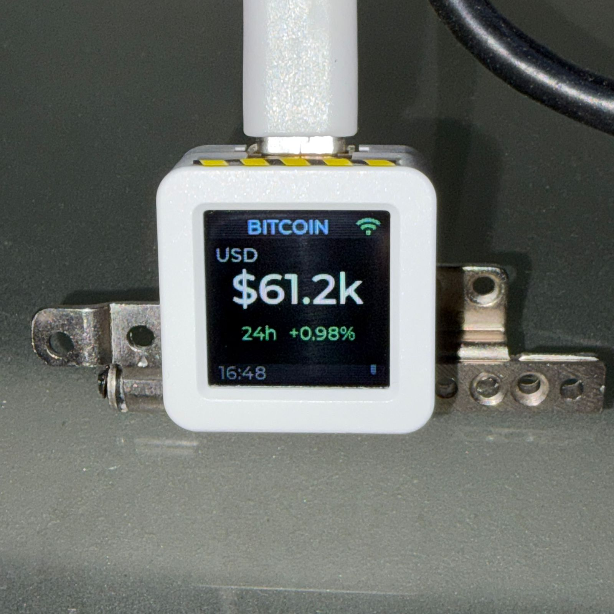
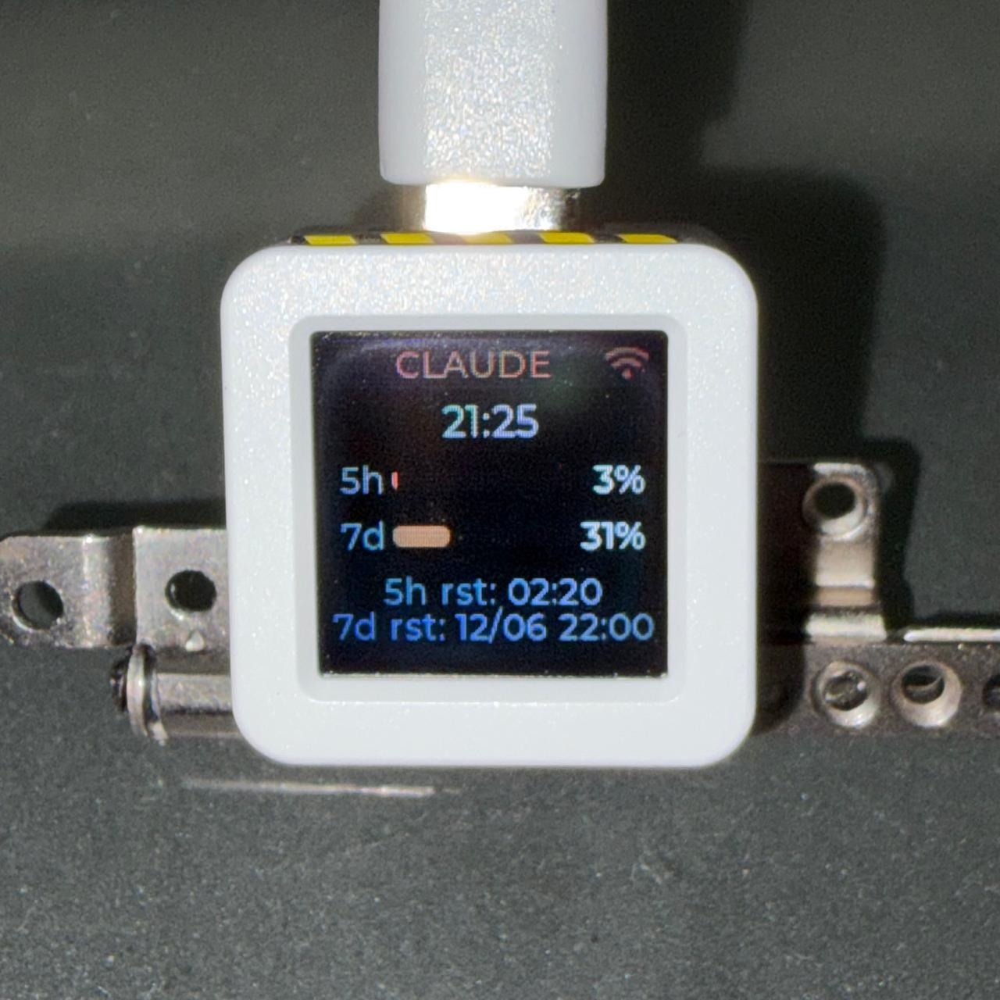

<h1 align=center>

AtomS3 Monitor

</h1>

A desktop monitor firmware for the [M5Stack AtomS3](https://docs.m5stack.com/en/core/AtomS3) — a tiny ESP32-S3 device with a 128×128 IPS display.

Displays a clock, Bitcoin price, and Claude Pro usage — switchable via tap on the built-in IMU.

<p align="center">
  
  
  
</p>

## Views

- **Clock** — local time (Argentina / GMT-3) with date
- **Bitcoin** — BTC/USD price and 24h change from CoinGecko, updated every 5 minutes
- **Claude** — Claude Pro usage (5h and 7d windows) with reset times, updated every 2 minutes

Tap the device to cycle between views.

## Hardware

| | |
|---|---|
| MCU | ESP32-S3 (M5Stack AtomS3) |
| Flash | 8 MB |
| Display | GC9107 128×128 IPS via SPI |
| IMU | MPU6886 via I2C (tap detection) |

## Requirements

- [ESP-IDF](https://github.com/espressif/esp-idf) v5.2+
- Components fetched automatically via `idf_component.yml`: LVGL 9.2, esp_lvgl_port, esp_lcd_gc9107

## Setup

1. Clone the repo
2. Copy credentials:
   ```
   cp main/secrets.h.example main/secrets.h
   ```
3. Edit `main/secrets.h` with your WiFi SSID and password
4. Add Claude credentials to `main/secrets.h` (see below)
5. Copy IDE config (optional):
   ```
   cp .vscode/settings.json.example .vscode/settings.json
   ```
6. Build and flash:
   ```
   idf.py set-target esp32s3
   idf.py build flash monitor
   ```

## Claude credentials

> [!WARNING]
> The tokens are extracted from your local Claude Code session and stored unencrypted in the ESP32 flash. For a personal desk device this is acceptable, but be aware that someone with physical access to the device could extract them. There is no official API for Claude Pro usage — this is the only known method.

Run this once to get both tokens:

```bash
cat ~/.claude/.credentials.json | python3 -c "
import sys, json
d = json.load(sys.stdin)['claudeAiOauth']
print('CLAUDE_ACCESS_TOKEN  =', d['accessToken'])
print('CLAUDE_REFRESH_TOKEN =', d['refreshToken'])
"
```

Copy both values into `main/secrets.h`:

```c
#define CLAUDE_ACCESS_TOKEN  "sk-ant-oat01-..."
#define CLAUDE_REFRESH_TOKEN "sk-ant-oat01-..."
```

### How the refresh works

The access token expires every ~8 hours. When the device gets a `401`, it uses the
refresh token to obtain a new access token automatically (via
`platform.claude.com/v1/oauth/token`), so you normally set this up only once.

Refreshed tokens are persisted to the ESP32's **NVS** flash, so they survive reboots
even if Anthropic rotates the refresh token. The values in `secrets.h` act as a seed:

- On boot, if the `secrets.h` refresh token still matches the one NVS was seeded from,
  the device uses the (possibly rotated) tokens stored in NVS.
- If you manually change the refresh token in `secrets.h` and reflash, the device
  detects the change and re-seeds NVS from `secrets.h`.

In short: update `secrets.h` only if the refresh chain ever breaks — otherwise the
device maintains its own tokens.

## Project structure

```
main/
  main.c              # WiFi, display, LVGL init, view manager
  imu.c/h             # MPU6886 tap detection
  shared_state.h      # shared state across apps and views
  apps/
    clock_app.c/h     # SNTP time sync
    bitcoin_app.c/h   # CoinGecko fetch + btc_state_t
    claude_app.c/h    # Claude usage fetch + token refresh (NVS-persisted)
  views/
    views.h
    clock_view.c      # LVGL clock screen
    bitcoin_view.c    # LVGL bitcoin screen
    claude_view.c     # LVGL Claude usage screen
```
